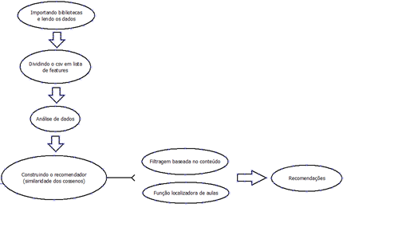
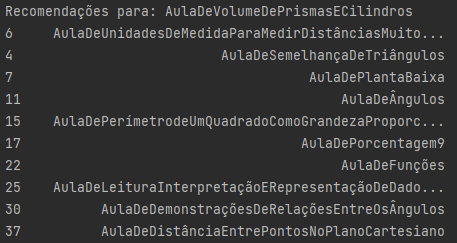

# recommender_system
<h1><b>Introdução</b></h1>

O algoritmo aqui disponibilizado, foi desenvolvido como base para trabalho de conclusão do curso de graduação em bacharelado de ciência e tecnologia, pela Universidade Federal Rural do Semi-Árido - UFERSA, Campus Mossoró - RN (2021).

<h1><b>Algoritmo de recomendação aplicado ao sistema SCIENCE</b></h1>
<h2><b>SCIENCE - Projeto Robótica Educacional</b></h2>

O SCIENCE, Sistema de GeraÇão Integrado de planos de aulas para o Ensino apoiado por RobótiCa Educacional, é um sistema que foi desenvolvido e idealizado para gerar planos de aula de matemática, contando com 41 aulas, sendo elas de 5 assuntos diferentes, e do 6º ao 9º ano. O plano gerado pelo sistema, além de ser estruturado como um plano comum, acompanhando as componentes curriculares, conteúdo, série, atividades, robôs, e todas as ferramentas necessárias, tem como objetivo a inserção da robótica educacional como um dos recursos para o ensino da matemática. O SCIENCE trata-se de um sistema web onde o professor (usuário), após realização de um cadastro, pode fazer buscas simples e avançadas para aulas de matemática. Para isso, foi desenvolvida uma ontologia para a disciplina de matemática. Na área da ciência da computação, ontologia significa um modelo de dados, que representa um conjunto de conceitos dentro de um domínio, e a correlação entre eles. Uma ontologia pode fazer inferências sobre os objetos que constam em seu domínio. As ontologias são muito utilizadas na web semântica, engenharia de software, e especialmente, na inteligência artificial. Nesse meio, a ontologia é utilizada como uma forma de representação de conhecimento sobre o mundo, ou alguma parte deste. Normalmente, descrevem os indivíduos, que são os objetos básicos, classes, que são os conjuntos, ou tipos de objetos, e atributos, que são as características ou parâmetros, que os objetos podem ter e compartilhar. 

<h2><b>SCIENCE - Algoritmo de recomendação</b></h2>

Atualmente, grande parte dos softwares que prestam algum tipo de serviço, contam com um sistema de recomendação. Um sistema de recomendação pode ser resumido em um algoritmo onde é possível, baseado, seja pelas notas dos usuários, ou pelo conteúdo dos serviços disponíveis, gerar recomendações de itens ou serviços. Os algoritmos são diferenciados no seu modelo de filtragem de dados. Existem três tipos de filtragem de dados, a filtragem colaborativa, a filtragem baseada no conteúdo e a filtragem mista, faremos uso da filtragem baseada no conteúdo para o desenvolvimento do sistema de recomendação do SCIENCE, Sistema de GeraÇão Integrado de Plano de Aula para o ENsino apoiado por RobóticCa Educacional. Partindo para a técnica de aprendizado de máquina utilizada, que após testes, a que melhor se adequou ao nosso caso, foi a técnica kNN (k-ésimo vizinho mais próximo). A métrica utilizada, foi a similaridade por cossenos, tendo assim, a similaridade mais fiel possível, baseado no ângulo de similaridade entre dois vetores. Este trabalho apresenta a elaboração e integração de um sistema de recomendação utilizando a filtragem baseada no conteúdo, e na criação de futuros algoritmos que utilizam filtragem colaborativa. 

<h2>Funcionamento</h2>
<h3>Estrutura: </h3>

<h3>Recomendações (Exemplo retirado dos testes):</h3>

<h1><b>Conclusão</b></h1>

Após a análise dos dados, e dos testes obtidos, podemos concluir que o uso de algoritmos de recomendação na plataforma SCIENCE, facilitará o fluxo da sua usabilidade, fazendo com que o usuário tenha a sua disposição, logo após algumas pesquisas, recomendações do que fazer em seguida. Baseado apenas nos conteúdos e séries das aulas, os testes nos mostram que o recomendador é capaz de recomendar aulas que estejam no mesmo escopo de assunto, e série, tornando assim, uma recomendação válida. 

